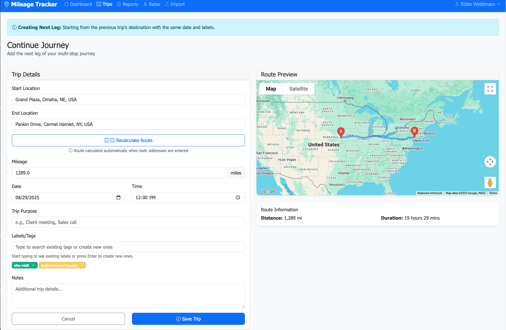

# Mobile Mileage Tracker

A responsive web application for tracking business miles according to IRS regulations, built with Laravel PHP framework.



## Features

- **User Authentication**: Secure account creation and login system
- **Trip Management**: Create, edit, and delete business trips with location search
- **Google Maps Integration**: Route confirmation and automatic mileage calculation
- **IRS Rate Management**: Configure yearly mileage rates (defaults to official IRS rates)
- **Dynamic Labels**: Automatically create and manage trip categorization labels
- **Comprehensive Reports**: Generate PDF and CSV reports with date range filtering
- **CSV Import**: Import existing trip data with validation and preview
- **Responsive Design**: Mobile-friendly interface that works on all devices

## Requirements

- PHP 8.1 or higher
- Composer
- SQLite or MySQL database
- Google Maps API key (for location services)

## Installation

1. **Clone the repository**
   ```bash
   git clone <repository-url>
   cd mileage
   ```

2. **Install dependencies**
   ```bash
   composer install
   ```

3. **Environment setup**
   ```bash
   cp .env.example .env
   php artisan key:generate
   ```

4. **Configure your environment**
   Edit `.env` file and set:
   - Database connection (SQLite is default)
   - Google Maps API key: `GOOGLE_MAPS_API_KEY=your_api_key_here`

5. **Database setup**
   ```bash
   touch database/database.sqlite  # For SQLite
   php artisan migrate
   ```

6. **Start the development server**
   ```bash
   php artisan serve
   ```

Visit `http://localhost:8000` to access the application.

## Google Maps API Setup

1. Go to the [Google Cloud Console](https://console.cloud.google.com/)
2. Create a new project or select an existing one
3. Enable the following APIs:
   - Maps JavaScript API
   - Places API
   - Directions API
   - Geocoding API
4. Create an API key and add it to your `.env` file
5. Configure API key restrictions for security

## Testing

Run the comprehensive test suite:

```bash
# Run all tests
php artisan test

# Run specific test types
php artisan test --testsuite=Feature
php artisan test --testsuite=Unit

# Run with coverage
php artisan test --coverage
```

## Usage

### First Time Setup
1. Visit the application URL
2. Click "Sign up" to create your account
3. Log in with your credentials

### Recording Trips
1. Click "Add Trip" from the dashboard or mobile navigation
2. Enter start and end locations (autocomplete will help)
3. Click "Calculate Route & Mileage" to get automatic distance calculation
4. Add trip purpose, labels, and notes
5. Save the trip

### Managing Mileage Rates
1. Go to "Settings" (or "Rates" on desktop)
2. View and edit the IRS mileage rate for each year
3. Rates default to official IRS rates but can be customized

### Generating Reports
1. Go to "Reports"
2. Select date range (use quick buttons or custom dates)
3. Choose PDF or CSV format
4. Click "Generate Report" to download

### Importing Existing Data
1. Go to "Import"
2. Download the CSV template or format your data accordingly
3. Upload your CSV file
4. Review the parsed data for errors
5. Confirm import to add all valid trips

## Database Structure

- **users**: User accounts and authentication
- **trips**: Individual trip records with location and mileage data
- **labels**: User-defined tags for trip categorization
- **trip_labels**: Many-to-many relationship between trips and labels
- **mileage_rates**: IRS mileage rates by user and year

## Security Features

- User data isolation (users can only access their own data)
- CSRF protection on all forms
- Password hashing
- Input validation and sanitization
- SQL injection protection via Eloquent ORM

## Mobile Responsiveness

The application is fully responsive and includes:
- Mobile-optimized navigation
- Touch-friendly interface elements
- Responsive tables and cards
- Mobile-specific quick actions
- Optimized forms for mobile input

## License

This project is open-sourced software licensed under the [MIT license](LICENSE).
